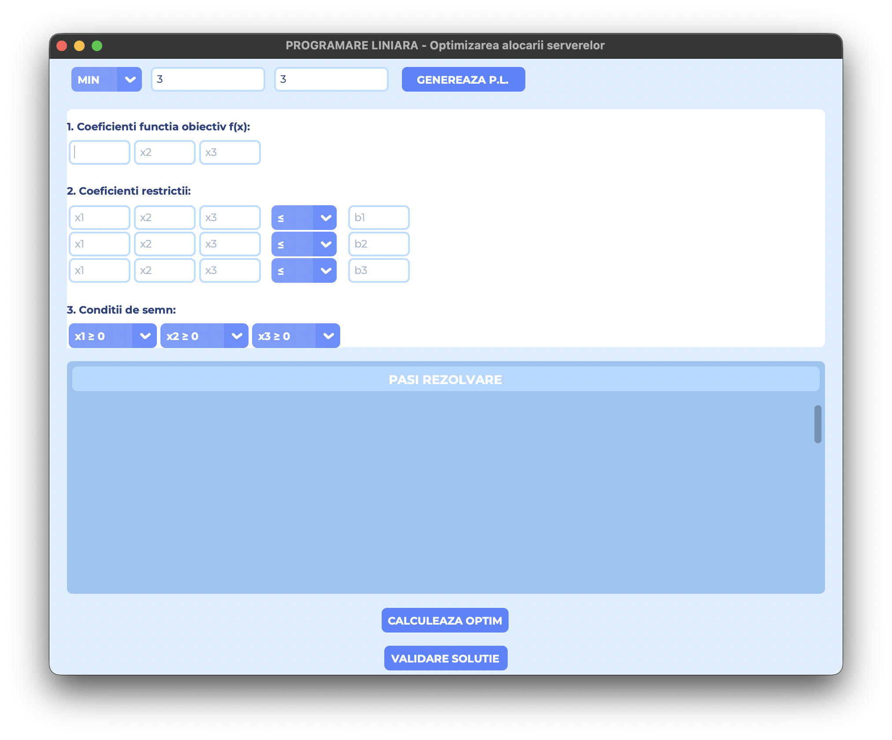
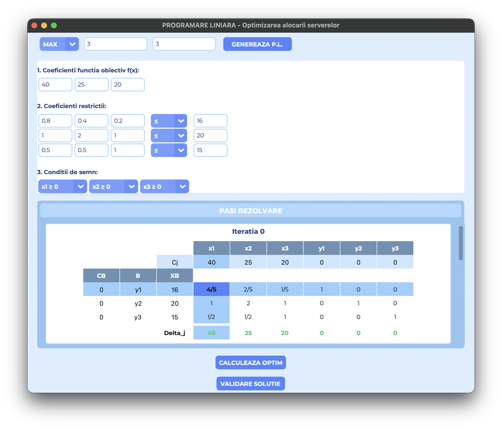
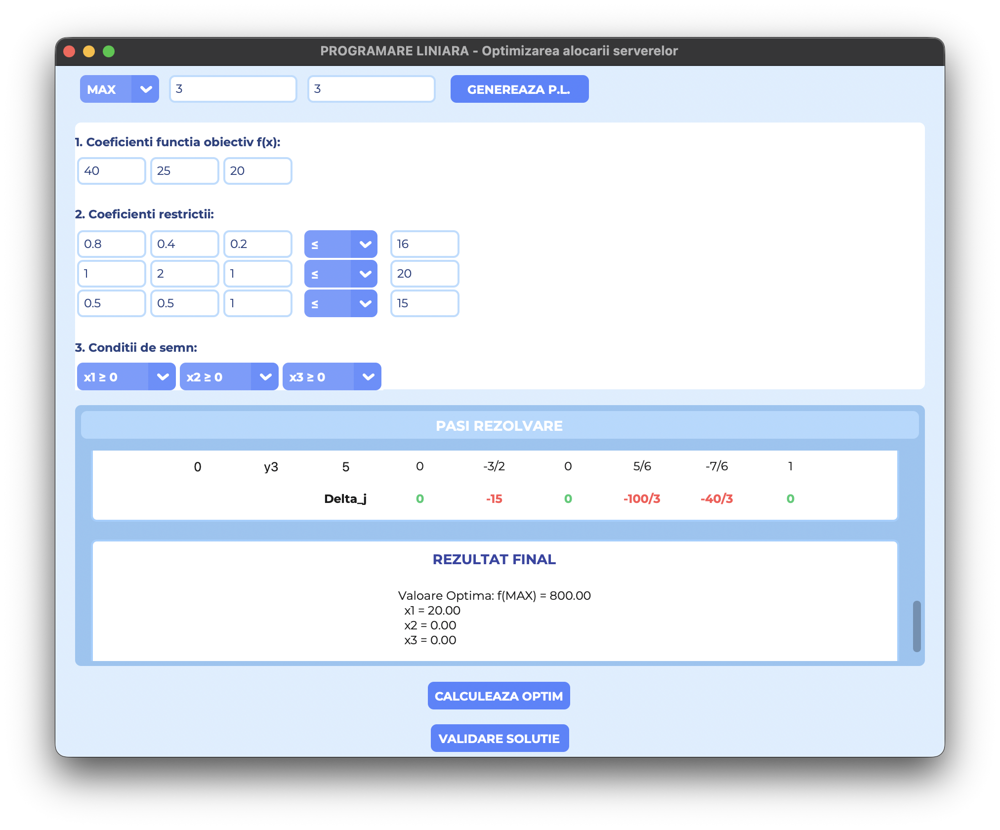

# 📊 Cercetări Operaționale — Proiecte


> 🧠 Implementări practice pentru concepte fundamentale din **Cercetări Operaționale**  
> 💡 Optimizare • Decizie • Strategie

---

## 📸 Demo

### 🔹 Programare Liniară
<p align="center">
  
  
  
</p>

Vezi prezentarea proiectului aici:  
[📊 Prezentare Canva](https://canva.link/3qqnm6nqomjgf80)
[📊 DRAFT](docs/DRAFT_PL.pdf)

### 🔹 Teoria Jocurilor

---

## 📚 Conținut

### 🔢 1. Programare Liniară []
- ✔️ Implementare metodă **Simplex**
- ✔️ Construire tabel simplex
- ✔️ Interfață pentru introducerea restricțiilor
- ✔️ Afișarea pașilor de calcul

## 🚀 Cum rulezi proiectul?
```bash
git clone https://github.com/adypicolo/PROIECT_CO
cd PROIECT_CO/PROIECT_1
pip install -r requirements.txt
python3 main.py
```
‼️Se instaleaza manual fontul ```Montserrat-VariableFont_wght.ttf``` din fisierul PROIECT_1

### 🎮 2. Teoria Jocurilor []
- ✔️ Modele de jocuri strategice
- ✔️ Determinarea echilibrului **Nash**
- ✔️ Analiza strategiilor mixte
- ✔️ Rezolvarea jocurilor matriceale

## 🚀 Cum rulezi proiectul?
```bash
git clone https://github.com/adypicolo/PROIECT_CO
cd PROIECT_CO/PROIECT_2
pip install -r requirements.txt
```

---

## 🛠️ Tech Stack

- 🐍 Python
- 📊 NumPy
- 🖥️ CustomTkinter

---

## 👨‍💻 Autori

<table border="0" cellspacing="10" cellpadding="0">
  <tr>
    <td align="center">
      <a href="https://github.com/adypicolo">
        <br/>
        <b>Vlad Adrian</b><br/>
        <a href="https://linkedin.com/in/vlad-adrian"></a>
        <a href="https://github.com/adypicolo"></a>
      </a>
    </td>
    <td align="center">
      <a href="https://github.com/imj31us4am50">
        <br/>
        <b>Volosenco Andreea-Laura</b><br/>
        <a href="https://linkedin.com/in/volosencoandreealaura"></a>
        <a href="https://github.com/imj31us4am50"></a>
      </a>
    </td>
    <td align="center">
      <a href="https://github.com/1adi13">
        <br/>
        <b>Stroescu Adrian-Gabriel</b><br/>
        <a href="https://linkedin.com/in/adrian-stroescu-5145a7357"></a>
        <a href="https://github.com/1adi13"></a>
      </a>
    </td>
    <td align="center">
      <a href="https://github.com/biancaiionela">
        <br/>
        <b>Tînjală Bianca-Ionela</b><br/>
        <a href="https://linkedin.com/in/biancaionelatinjala"></a>
        <a href="https://github.com/biancaiionela"></a>
      </a>
    </td>
  </tr>
</table>

---

